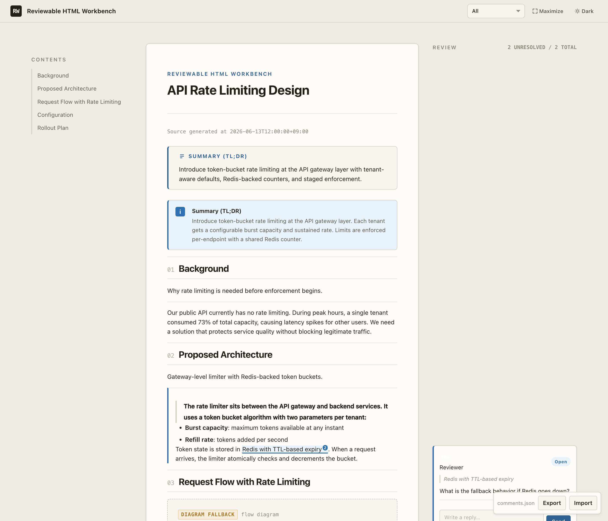

# Reviewable HTML Workbench

[](https://github.com/u-ichi/reviewable-html-workbench/actions/workflows/test.yml)


A Claude Code / Codex CLI plugin for generating reviewable HTML documents with preview server, inline review comments, and agent feedback ingestion.



## Overview

Agent workflows often produce long reports, design documents, research notes, and comparison tables that need human review before they become useful. Plain text and chat messages make that review hard: comments lose their location, generated diagrams are difficult to inspect, and follow-up changes are easy to miss.

Reviewable HTML Workbench turns those outputs into self-contained HTML bundles with structured document blocks, generated assets, a local preview runtime, and review comments attached to exact document ranges. It is built for Claude Code and Codex CLI plugin workflows, while keeping the runtime small: Python 3.11+, standard library only, HTML, CSS, and vanilla JavaScript.

The plugin includes two skills. `visual-html-renderer` creates, validates, renders, and previews visual HTML documents. `reviewable-design-doc` builds review-ready design documents and can ingest HTML comments back into the agent workflow, including agent replies and review-cycle state.

## Features

- **Document Model**: schema-driven document input for predictable HTML generation.
- **HTML Rendering**: produces `index.html`, copied assets, and `renderer-manifest.json`.
- **Preview Server with Tailscale**: starts a session-scoped preview server, preferring Tailscale IPv4 and falling back to `127.0.0.1`; `0.0.0.0` bind is rejected.
- **Inline Review Comments**: comment highlights, margin cards, replies, status changes, import, and export.
- **Review Ingestion**: reads `annotations/comments.json`, classifies comments, writes agent replies, and saves review-cycle state.
- **Dark/Light Theme**: UI support for theme switching in rendered review documents.
- **Diagram + Image Support**: stores Mermaid sources, renders fallback diagrams, and attaches generated image assets to document model blocks.

## Installation

### Claude Code

Add the GitHub repository as a plugin marketplace and install:

```bash
claude plugin marketplace add u-ichi/reviewable-html-workbench
claude plugin install reviewable-html-workbench
```

Alternatively, clone the repository and install locally:

```bash
git clone https://github.com/u-ichi/reviewable-html-workbench.git
cd reviewable-html-workbench
claude plugins install .
```

For local development, run Claude Code with this plugin directory:

```bash
claude --plugin-dir /path/to/reviewable-html-workbench
```

### Codex CLI

Add the GitHub repository as a plugin marketplace:

```bash
codex plugin marketplace add u-ichi/reviewable-html-workbench
```

Or clone and register locally:

```bash
git clone https://github.com/u-ichi/reviewable-html-workbench.git
codex plugin marketplace add ./reviewable-html-workbench
```

## Quick Start

Create a document model from source text:

```bash
python3 -m scripts.html_review_workbench.cli build-model \
  --text "Write a short reviewable design note." \
  --title "Example Design Note" \
  --document-id example-design-note \
  --output output/tmp/example/document-model.json
```

For final HTML output, agents should refine the document model directly before rendering. Then validate and render it:

```bash
python3 -m scripts.html_review_workbench.cli check-model \
  --model output/tmp/example/document-model.json

python3 -m scripts.html_review_workbench.cli render \
  --model output/tmp/example/document-model.json \
  --output output/tmp/example/bundle

python3 -m scripts.html_review_workbench.cli validate \
  --root output/tmp/example/bundle
```

Start a preview server:

```bash
python3 -m scripts.html_review_workbench.cli preview \
  --root output/tmp/example/bundle \
  --mode auto
```

After human review, ingest comments from the generated bundle:

```bash
python3 -m scripts.html_review_workbench.cli ingest-review \
  --root output/tmp/example/bundle
```

## Skills

| Skill | Purpose | Trigger examples |
|---|---|---|
| `visual-html-renderer` | Generate, validate, and preview final HTML bundles from document models. | `html出力して`, `HTMLにして`, `HTMLで出して`, `この内容をHTMLで出して`, `HTMLでプレビューして`, `HTMLレンダラー`, `HTML出力を共通化`, `図示つきHTML`, `visual HTML renderer` |
| `reviewable-design-doc` | Create review-ready design documents and ingest review comments back into the workflow. | `レビュー可能な設計資料`, `設計資料をHTMLで`, `design doc`, `reviewable design doc`, `レビュー終わったので確認して`, `コメントを反映して` |

## CLI Reference

All commands are exposed through:

```bash
python3 -m scripts.html_review_workbench.cli <command>
```

| Command | Description |
|---|---|
| `build-model` | Build a document model from natural content. |
| `render` | Generate an HTML bundle from a document model. |
| `check-model` | Check whether a document model is ready for final HTML rendering. |
| `attach-image` | Attach a generated image asset to an image-capable block in a document model. |
| `preview` | Start or describe a session-scoped preview runtime. |
| `ingest-review` | Read review comments, classify them, write agent replies, and save review-cycle state. |
| `validate` | Validate a generated HTML bundle. |

## Schemas

The workbench is schema-driven:

- `schemas/document-model.schema.json`
- `schemas/comments.schema.json`
- `schemas/preview-session.schema.json`

These schemas define the rendered document model, persisted review comments, and preview session metadata.

## Development

Requirements:

- Python 3.11+
- No Python package dependencies for the core runtime
- Standard library tests with `unittest`

Run tests:

```bash
PYTHONPYCACHEPREFIX="$PWD/tmp/python-pycache" python3 -m unittest discover -s tests
```

Validate plugin manifests:

```bash
python3 -m json.tool .claude-plugin/plugin.json >/dev/null
python3 -m json.tool .codex-plugin/plugin.json >/dev/null
```

Validate the Claude Code plugin manifest:

```bash
claude plugins validate .
```

Check the CLI entrypoint:

```bash
python3 -m scripts.html_review_workbench.cli --help
```

## License

MIT

<details>
<summary>日本語</summary>

Reviewable HTML Workbench は、Claude Code / Codex CLI 向けの HTML レビュー用プラグインです。設計資料、調査レポート、比較表、図示つきドキュメントをレビュー可能な HTML bundle として生成し、ローカルまたは Tailscale 経由の preview server で確認できます。

主な機能は、schema 駆動の document model、HTML レンダリング、Preview Runtime、本文に紐づくレビューコメント、コメント取り込み、agent reply 書き戻し、図・生成画像サポートです。

2つの skill を含みます。

- `visual-html-renderer`: HTML生成、図示、Preview Runtime、bundle検証。
- `reviewable-design-doc`: レビュー可能な設計資料作成、コメント取り込み、agent返信、設計反映。

インストール:

```bash
# Claude Code（GitHub から直接）
claude plugin marketplace add u-ichi/reviewable-html-workbench
claude plugin install reviewable-html-workbench

# Codex CLI（GitHub から直接）
codex plugin marketplace add u-ichi/reviewable-html-workbench
```

テストは次のコマンドで実行します。

```bash
PYTHONPYCACHEPREFIX="$PWD/tmp/python-pycache" python3 -m unittest discover -s tests
```

</details>
